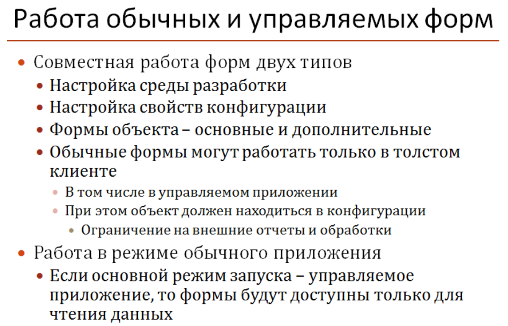

# 1CdevFastStart

+ **Module 1. Hello world. UI. Datetime function. Simple algorithms.**

+ **Module 2. 1C structures**
    + Catalog (🇷🇺 *Справочики*)
    + Constant (🇷🇺 *Констант*)
    + Subsystem (🇷🇺 *Подсистема*)
    + Document journal (🇷🇺 *Журнал документов*)
    + Documents (🇷🇺 *Документ*)
    + External Processing (🇷🇺 *Внешняя обработка*)
    + Common module (🇷🇺 *Общий модуль*)
    + Transaction (🇷🇺 *Транзакция*)

    

+ **Module 3. Transaction. Structured Query Language.**
    + Query programming (🇷🇺 *Запрос*)
    + SELECT (1, *, ...) FROM
    + GROUP BY
    + TOTAL BY (🇷🇺 ИТОГИ ПО)
    + WHERE
    + UNION (ALL)
    + JOIN (LEFT, RIGHT, INNER, OUTTER)
    + Temporary table: PLACE (🇷🇺 ПОМЕСТИТЬ), `;` symbol
    + Print form (🇷🇺 Макет)

    

    + Report - Data composition system
        
        1. Условие выбора без иерархии
        ```sql
        ГДЕ
            НЕ Контрагенты.ЭтоГруппа
        ```
        2. Условие выбора не принадлежать элементам списка другой таблицы
        ```
        НЕ Контрагенты.Ссылка В
                (ВЫБРАТЬ РАЗЛИЧНЫЕ
                    НеПрочих.Контрагент
                ИЗ
                    НеПрочих КАК НеПрочих)
        ```

+ **Module 3. UI**
    + Processing by register
    + Subsystem, command
    + Form objects: `ОСНОВНЫЕ` & `ДОПОЛНИТЕЛЬНЫЕ` (second opinion form)

    

    + **Delete rows from the tabular part of the document**
        + All
        ```cpp
        ТабличнаяЧастьДок.Очистить(); // ТабличнаяЧастьДок - название табличного поля
        ```
        + By condition
        ```cpp
        //  Получим документ и укажем параметры поиска 
        ОбъектДок = СсылкаДок.ПолучитьОбъект(); 
        
        СтруктураДляПоиска = Новый Структура("Количество", 0); 
        
        ТабличнаяЧастьДок = ОбъектДок.Товары; 
        
        // Получаем список строк соответсвтвующих отбору, и перебором удаляем
        МассивПустыхСтрок = ТабличнаяЧастьДок.НайтиСтроки(СтруктураДляПоиска); 
        
        Для каждого Строка Из МассивПустыхСтрок Цикл 
        
            ТабличнаяЧастьДок.Удалить(Строка); 
        
        КонецЦикла; 
        
        ОбъектДок.Записать(); // Записываем изменения в документе
        ```
