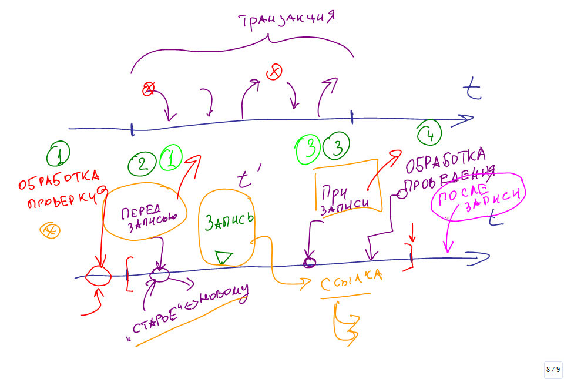
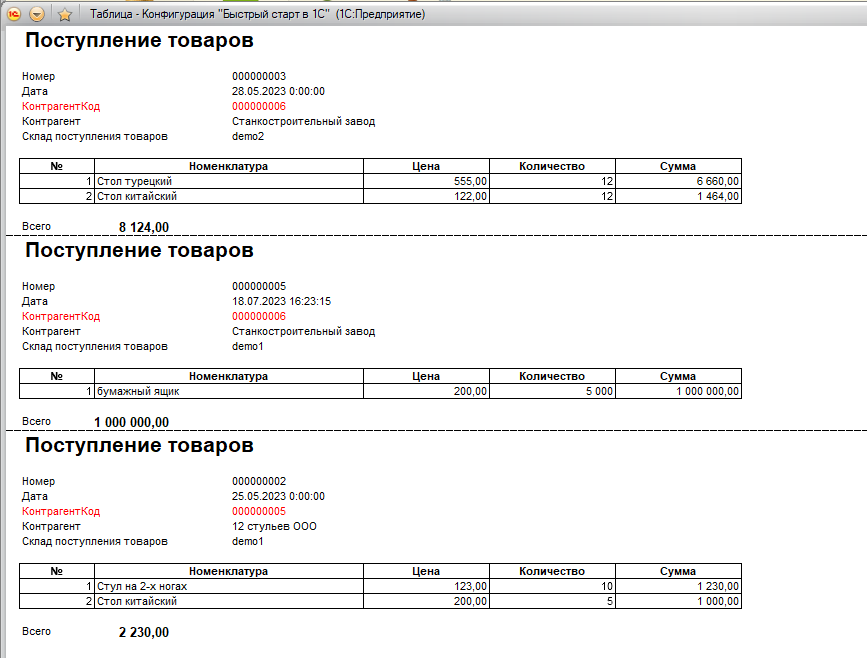

# 1CdevFastStart

+ **Module 1. Hello world. UI. Datetime function. Simple algorithms.**

+ **Module 2. 1C structures**
    + Catalog (🇷🇺 *Справочики*)
    + Constant (🇷🇺 *Констант*)
    + Subsystem (🇷🇺 *Подсистема*)
    + Document journal (🇷🇺 *Журнал документов*)
    + Documents (🇷🇺 *Документ*)
    + External Processing (🇷🇺 *Внешняя обработка*)
    + Common module (🇷🇺 *Общий модуль*)
    + Transaction (🇷🇺 *Транзакция*)

    

+ **Module 3. Transaction. Structured Query Language.**
    + Query programming (🇷🇺 *Запрос*)
    + SELECT (1, *, ...) FROM
    + GROUP BY
    + TOTAL BY (🇷🇺 ИТОГИ ПО)
    + WHERE
    + UNION (ALL)
    + JOIN (LEFT, RIGHT, INNER, OUTTER)
    + Temporary table: PLACE (🇷🇺 ПОМЕСТИТЬ), `;` symbol
    + Print form (🇷🇺 Макет)

    